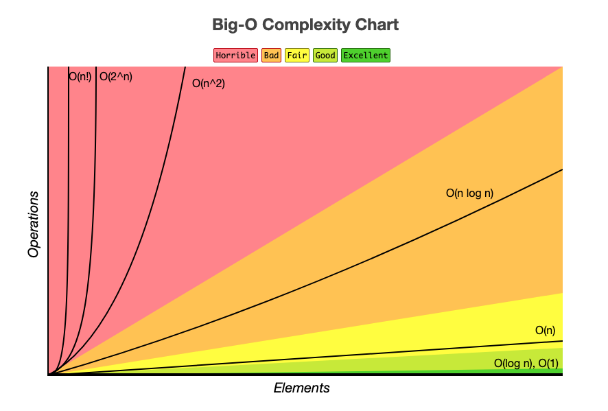

# Big-O swift with examples

A simple repository detailing some important concepts of Big-O notation, with examples written in Swift.

## Big-O Main Concepts

In computer science, Big-O notation is used to express the performance or complexity of an algorithm. Big O expresses the worst-case scenario and can be used to define the execution time or space required by an algorithm (e.g., in memory or on disk).

Two main concepts:

- **Time Complexity:** An algorithm's time complexity estimates the amount of time it takes to run as a function of the length of the input. It should be noted that the time to execute is determined by the length of the input rather than the actual execution time of the machine on which the algorithm is operating.

- **Space Complexity:** An algorithm's space complexity estimates the amount of space required to perform an algorithm as a function of the length of the input.

- **The order of growth** describes how the execution time changes with input length. The following are some of the most common orders of growth in Big O notation:

[Big-O Complexity Chart](https://www.bigocheatsheet.com)
